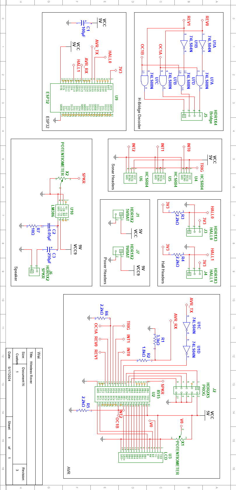

# User Guide

## 1.0 Introduction

The Wireless Rover is a two wheeled remote-controlled land vehicle designed to map floor areas. It includes frontal, left and right ultrasonic sensors, two hall-effect odometers, a camera, and a speaker. The wireless rover connects to Wi-Fi to be controlled by a web application with 3D visualization.

## 2.0 Setup and Operation

### Setting up the Web Application

The web application is the remote control and configurer of the Wireless Rover vehicule. There are two options available:

1. Use the online hosted version courtesy of GitHub pages. https://schoolwei.github.io/project-wrover
2. Use the Raspberry Pi or any machine with Docker installed.
   - MacOS
   - Linux
   - Windows WSL2

> The moment the machine boots up, the service should be automatically started. The Rasperry Pi will have hostname `weispi` or `weispi.local`. The service will be available at `http://weispi.local:8080` or `https://weispi:8443`.

### Setting up the Wi-Fi Connection

Please make sure that you have a Wi-Fi connection because the Rover will connect to the Wi-Fi network to be controlled by the web application. A hopspot will suffice, but make sure that it has access to the website.

### Setting up the Wireless Rover

1. Make sure the power switch is off. Please see Figure 1A for the location of the power switch.
2. Connect the two 9V batteries and the 4.8V rechargeable battery.
3. Turn on the power switch see if power is properly connected. You should hear a tune. You should see the following messages in order:
   - `WRover AVR!` and `Waiting ESP...` on the LCD screen as seen in Figure 2A.
   - `WRover ESP` and `ESP Starting...` on the LCD screen as seen in Figure 3A.
   - `WRover ESP` and `Waiting Setup...` on the LCD screen as seen in Figure 4A. You may see another message if it is already configured to connect to a Wi-Fi network.
4. Make sure to then turn off the power switch.
5. Plug the USB-C cable into the USB-C port as seen in Figure 1A. Do not turn on the power switch yet.
6. Connect the other end of the USB-C cable to a machine that has access to the web application and the Wi-Fi network.
7. Navigate to the web application on a browser.
8. Click on Start Serial Setup as seen in Figure 8A. Please use another browser if you see the message in Figure 9A.
9. Select the serial port that the Wireless Rover is connected to as seen in Figure 10A.
10. Right after selecting the serial port, it should immedately start scanning for networks as seen in Figure 11A. If it does not, the serial port is not connected properly.
11. Select the network that the Wireless Rover should connect to as seen in Figure 12A.
12. Click on Connect Network. Make sure you click on the button with the name of the network (SSID) as text.
13. You should be prompted to connect to the network as seen in Figure 13A.
14. If the connection is successful, you should see the IP address of the Wireless Rover as seen in Figure 14A. If it is not successful, you should see the message in Figure 15A. Please retry again. If it still does not work, make sure that the computer used have access to the Wi-Fi network.
15. Unplug the USB-C cable from the Wireless Rover. The Wireless Rover will turn off. However, the WiFi configuration is saved.
16. Turn on the power switch. The last message you should see is `WiFi Connected: <IP Address>` on the LCD screen as seen in Figure 6A.
17. Reload the web application.
18. You are ready to control the Wireless Rover.

### Controlling the Wireless Rover

The Wireless Rover can be controlled manually. The controls are as follows:

- `W` to move forward.
- `A` to move left.
- `S` to move backward.
- `D` to move right.

The Rover can also be controlled in a semi-automatic manner by right-clicking on the map. This will open a context menu. Select the option to move the Rover to the selected location as seen in Figure 17A. The Rover will automatically move to the location. This method has primitive obstacle avoidance. Therefore, it will attempt to go around obstables based on some heuristics.

Furthermore, there is also collision avoidance. The Rover will stop if it detects an obstacle in front of it.

### Seeing the World through the Wireless Rover

The Wireless Rover will stream all of its sensor information in real time to the web application.

- Distance on the left, right, and front ultrasonic sensors.
- Camera feed.

The camera framerate will be limited by the network speed and will automatically adjust to the network speed.

You can also select the resolution of the camera feed by right clicking on it. The resolution can be selected from the dropdown menu. The resolution can be changed at any time.

The Wireless Rover will map the floor area as it moves. To see the map from a different perpective, use the following controls:

- Left Mouse Button to rotate the map.
- Middle Mouse (Scoll Wheel) Button to pan the map.
- Scroll Wheel to zoom in and out.

### Audio Feedback

The Rover will play a tune when:

- The power is turned on.
- It moves.
- It detects an obstacle in front, left, or right.

There is no way to turn off the audio feedback and that is a feature! It reduces the risk of accidents.

## 3.0 Specifications

_Table 1. Specifications of the Wireless Rover._

| Group              | Name         | Value    |
| ------------------ | ------------ | -------- |
| Power Source       | 9V Batteries | 2        |
|                    | 4.8V Battery | 1        |
| Dimensions         | Length       | 18 cm    |
|                    | Width        | 35 cm    |
|                    | Height       | 8 cm     |
| Weight             |              | ~1 kg    |
| Top Speed          |              | 0.5 m/s  |
| Battery Life       | Stationary   | ~2 hour  |
|                    | Moving       | ~30 mins |
| Camera Resolsution | Maximum      | 800x600  |
|                    | Minimum      | 160x120  |
| Ultrasonic Sensor  | Max          | ~4.4m    |
|                    | Resolution   | ~2cm     |
| Camera Framerate   | Maximum      | 30 fps   |
|                    | Minimum      | 1 fps    |

# Technical Guide

## 4.0 System Diagram

Only the Web Application is not part of the Rover itself. All of the components are powered by a 5V power supply, except for the motors which are powered by a 9V power supply.

_Figure 4.1T. System Diagram. The Web Application is not part of the rover. The rest is powered by a ~4.8V battery unless indicated otherwise. All modules are completed._

## 5.0 System Description

### Modules

- The Web Application Module is the user interface for controlling the Rover.

  - It will visualize the sensor data by constructing the walls.
  - The WASD keys will control the Rover.
  - The camera feed will be displayed on the Web Application.

- ESP32 Module is the main controller of the Rover.

  - It will receive commands from the Web Application and send sensor data to the Web Application.
  - It will also control the motors and the ultrasonic sensors by sending serial data to the AVR.
  - It will connect to the Wi-Fi network to communicate with the Web Application.

- ATmega8515 Module is the secondary controller of the Rover.
  - It will receive motor commands from the ESP to control the motors using PWM.
  - It will also read the ultrasonic sensors and send the data to the ESP32.
  - It will also control the LCD screen and the speaker.

### Peripherals

- The Left and Right Wheel Hall Effect Sensors will be read by the ESP32 to calculate the distance traveled by the Rover similar to an odometer.

- The Left and Right Wheel H-Bridges will control the motors by receiving PWM signals from the AVR.

- The Front, Left, and Right Ultrasonic Sensors will be read by the AVR to detect obstacles.

- The Amplifier will amplify the audio signal from the AVR to the Speaker.

- The Speaker will play audio feedback.

- The LCD will display the status of the Rover.

- The Camera will stream video feed to the Web Application.

## 6.0 Circuit Description

_Figure 6.1T. Full Circuit Schematic Diagram._

### H-Bridge Decoder

The H-Bridge Decoder/Multiplexer sends the PWM signal to the right pin with respect to the direction of the motor.

### Sonar Headers

The Sonar Headers are the headers for the ultrasonic sensors. The pins are connected to the AVR.

### Hall Effect Headers

The Hall Effect Headers are the headers for the hall effect sensors. The pins are connected to the ESP32. The hall effect sensor needs a pull-up resistor. The pull-up resistor is connected to the 3.3V power supply of the ESP32.

### Power Headers

These are the headers for the different power supplies.

### Speaker

The Speaker section has the amplifier and the speaker. The amplifier is connected to the AVR. There is a potentiometer to adjust the volume.

### AVR

The AVR is the main physical controller of the Rover. It controls the motors, the ultrasonic sensors, the LCD, motors, and the speaker.

Since the ESP32 and the AVR are connected via serial and require different voltages. There is a voltage divider to convert the 5V signal to 3.3V signal for AVR to ESP32 communication. To convert 3.3V to 5V, two TTL compatible NOT gates are used. This is because a 3.3V is high enough to be interpreted as a high signal by the TTL compatible NOT gates.

The ISP header is included to easily program the AVR.

## 7.0 Software Description

## 8.0 Testing and Calibration

## 9.0 Troubleshooting

# Appendix

## A. Illustrations

_Figure 1A. The rear diagram of the Wireless Rover._

_Figure 2A. WRover Waiting ESP._

_Figure 3A. WRover ESP Starting._

_Figure 4A. WRover Waiting Setup._

_Figure 5A. WRover ESP Connecting._

_Figure 6A. WRover ESP Connected._

_Figure 7A. WRover ESP Setup Required._

_Figure 8A. Serial Setup Page._

_Figure 9A. Web No Serial._

_Figure 10A. Serial Port Selection._

_Figure 11A. Scanning Networks._

_Figure 12A. Network List._

_Figure 13A. Connect Network._

_Figure 14A. IP Connect._

_Figure 15A. IP Connect Failed._

_Figure 16A. Camera Resolution Selection._

_Figure 17A. Click to Move._

## B. Code/Script Listings

## C. Bill of Materials

## D. Cost Analysis
