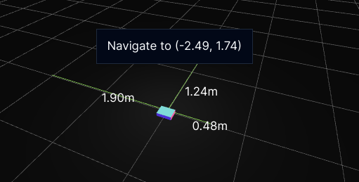

# Wireless Rover Manual

##### Open Sourced under MIT License at [https://schoolwei.github.io/project-wrover](https://schoolwei.github.io/project-wrover)

<pre style="font-size: 11px; border: none; background: transparent; line-height: 1; page-break-after: always; margin: 150px 64px">
                                                                    ||
                                                  __..--".          ||
                                 __..--""`._..--"" . . . .`.        ||
                         __..--"". . . . . . .`. . . . . . .`.      ||
                 __..--"". . . . .`. . . . . . .`. . . . . . .`.   //
         __..--"". . `.  . . . . . .`. . . . . . .`. . . . . . .`.//
  _..--""  . . . . . . `.  . . . . . .`. . . . . . .`. . . . . . .||
:". . . .`.  . . . . . . `.  . . . . . .`. . . . . . .`. . . . . .||`.
`:. . . . .`.  . . . . . . `.  . . . . . .`. . . . . . .`. . . . .||__\
  `:. . . . .`.  . . . . . . `.  . . . . . .`. . . . . . .`.__..-o||
    `:. . . . .`.  . . . . . . `.  . . . . . .`. . . . .`;Y"-.   ""
      `:. . . . .`.  . . . . . . `.  . . . . . .`. . . __.>.:'
        `:. . . . .`.  . . . . . . `.  . . . . __..--"" ..+"`.
   _..-._ `:. . . . .`.  . . . . . . `.__..--"" ....:::::.|   `.
 ."`` \_--" =:. . . . .`.  . . __..,-|" . ..::::::::::::::`--""-:.
' ..`\J.-  "8-`:. . .  __..--"" ...-I  \ `. `::::::::::::::::::::".
`/'\\88o. ,O \  `:.--""....:|:::'''`'\ ='. }-._'::::::::::::::::::|
8  8|PP|"(:. \-" ""`:::::::|:::.((::='/ .\""-.:_ ':::::::::::''_.'  _..
 8  8|::/ \`::Y  _____`:::::|::::.\\[ .\ "/"..* *"-. '''__..--"")\,"".-.\_
`\b d/""===\==V::.--..__`:::|:::::.|,'*."".:.. "_-.*`.""    _.-"-""\? "_=``.
\\`".`"' .: :-.::.        `:|:::.'.'*.' __..--""   `.*`:--"".-"?,  .)=""`\ \\
 `.``...''_/   ``::      _\\--.'.'*.'-""   _..-._ _..\.*;-""@_.-/-" `\.-"""-.\
   `-::--"            .-"@"}.'.'*.:)     ."\` \ \`.--'_`-'     `\. \-'-""-   `.
                      \  _...'*.'      .' \.`\ `\ \\""         `\ `' ' .-.\   |
                     _\"" .---'        -\. `\.-"""-.\           \`|    ._)/   '
                   ."\.`-"\`.         `\. \-'-""-   `.           \\  `---"   /
                 .' \.`\ `\ \\        `\ `' ' .-.\   |            `.       _/
                 -\. `\.-"""-.\        \`|    ._)/   '              `-..--"
                `\. \-'-""-   `.        \\  `---"   /
                `\ `' ' .-.\   |         `.       _/
                 \`|    ._)/   '           `-..--"
                  \\  `---"   /
                   `.       _/
                     `-..--"
</pre>

# Table of Contents

- [Wireless Rover Manual](#wireless-rover-manual)
        - [Source code: https://schoolwei.github.io/project-wrover](#source-code-httpsschoolweigithubioproject-wrover)
- [Table of Contents](#table-of-contents)
- [User Guide](#user-guide)
  - [1.0 Introduction](#10-introduction)
  - [2.0 Setup and Operation](#20-setup-and-operation)
    - [Setting up the Web Application](#setting-up-the-web-application)
    - [Setting up the Wi-Fi Connection](#setting-up-the-wi-fi-connection)
    - [Setting up the Wireless Rover](#setting-up-the-wireless-rover)
    - [Controlling the Wireless Rover](#controlling-the-wireless-rover)
    - [Seeing the World through the Wireless Rover](#seeing-the-world-through-the-wireless-rover)
    - [Audio Feedback](#audio-feedback)
  - [3.0 Specifications](#30-specifications)
- [Technical Guide](#technical-guide)
  - [4.0 System Diagram](#40-system-diagram)
  - [5.0 System Description](#50-system-description)
    - [Web Application](#web-application)
    - [ESP32](#esp32)
    - [ATmega8515](#atmega8515)
    - [Peripherals](#peripherals)
  - [6.0 Circuit Description](#60-circuit-description)
    - [H-Bridge Decoder](#h-bridge-decoder)
    - [Sonar Headers](#sonar-headers)
    - [Hall Effect Headers](#hall-effect-headers)
    - [Power Headers](#power-headers)
    - [Speaker](#speaker)
    - [AVR](#avr)
    - [ESP32](#esp32-1)
    - [LCD](#lcd)
  - [7.0 Software Description](#70-software-description)
    - [Web Application](#web-application-1)
      - [Initial WiFi Setup](#initial-wifi-setup)
      - [Calculating the Relative Position](#calculating-the-relative-position)
    - [ESP32](#esp32-2)
      - [Request and Response Flow](#request-and-response-flow)
      - [Acknowledged Serial](#acknowledged-serial)
      - [AVR Serial, Async Serial and Promises in ESP32](#avr-serial-async-serial-and-promises-in-esp32)
      - [Transmitting and Receiving Data](#transmitting-and-receiving-data)
      - [Smooth Motor Control](#smooth-motor-control)
      - [Hall Effect Sensors](#hall-effect-sensors)
      - [ESP32 and Web Communication](#esp32-and-web-communication)
    - [Atmega8515](#atmega8515-1)
      - [Reading Ultrasonic Sensors](#reading-ultrasonic-sensors)
      - [PWM and Smooth Motor Control](#pwm-and-smooth-motor-control)
      - [Acknowledged Serial](#acknowledged-serial-1)
      - [AVR and ESP32 Communication](#avr-and-esp32-communication)
  - [8.0 Testing and Calibration](#80-testing-and-calibration)
  - [9.0 Troubleshooting](#90-troubleshooting)
- [Appendix](#appendix)
  - [A. Illustrations](#a-illustrations)
  - [B. Code/Script Listings](#b-codescript-listings)
  - [C. Bill of Materials](#c-bill-of-materials)
  - [D. Cost Analysis](#d-cost-analysis)
  - [E. References](#e-references)
    - [Web Application](#web-application-2)
    - [ESP32](#esp32-3)
    - [AVR](#avr-1)
    - [Datasheets](#datasheets)
    - [README.md](#readmemd)


# User Guide

## 1.0 Introduction

The Wireless Rover is a two wheeled remote-controlled land vehicle designed to map floor areas. It includes frontal, left and right ultrasonic sensors, two hall-effect odometers, a camera, and a speaker. The wireless rover connects to Wi-Fi to be controlled by a web application with 3D visualization.

## 2.0 Setup and Operation

### Setting up the Web Application

The web application is the remote control and configurer of the Wireless Rover vehicule. There are two options available:

1. Use the online hosted version courtesy of GitHub pages. https://schoolwei.github.io/project-wrover
2. Use the Raspberry Pi or any machine with Docker installed.
   - MacOS
   - Linux
   - Windows WSL2

> The moment the machine boots up, the service should be automatically started. The Rasperry Pi will have hostname `weispi` or `weispi.local`. The service will be available at `http://weispi.local:8080` or `https://weispi:8443`.

### Setting up the Wi-Fi Connection

Please make sure that you have a Wi-Fi connection because the Rover will connect to the Wi-Fi network to be controlled by the web application. A hopspot will suffice, but make sure that it has access to the website.

### Setting up the Wireless Rover

1. Make sure the power switch is off. Please see Figure 1A for the location of the power switch.
2. Connect the two 9V batteries and the 4.8V rechargeable battery.
3. Turn on the power switch see if power is properly connected. You should hear a tune. You should see the following messages in order:
   - `WRover AVR!` and `Waiting ESP...` on the LCD screen as seen in Figure 2A.
   - `WRover ESP` and `ESP Starting...` on the LCD screen as seen in Figure 3A.
   - `WRover ESP` and `Waiting Setup...` on the LCD screen as seen in Figure 4A. You may see another message if it is already configured to connect to a Wi-Fi network.
4. Make sure to then turn off the power switch.
5. Plug the USB-C cable into the USB-C port as seen in Figure 1A. Do not turn on the power switch yet.
6. Connect the other end of the USB-C cable to a machine that has access to the web application and the Wi-Fi network.
7. Navigate to the web application on a browser.
8. Click on Start Serial Setup as seen in Figure 8A. Please use another browser if you see the message in Figure 9A.
9. Select the serial port that the Wireless Rover is connected to as seen in Figure 10A.
10. Right after selecting the serial port, it should immedately start scanning for networks as seen in Figure 11A. If it does not, the serial port is not connected properly.
11. Select the network that the Wireless Rover should connect to as seen in Figure 12A.
12. Click on Connect Network. Make sure you click on the button with the name of the network (SSID) as text.
13. You should be prompted to connect to the network as seen in Figure 13A.
14. If the connection is successful, you should see the IP address of the Wireless Rover as seen in Figure 14A. If it is not successful, you should see the message in Figure 15A. Please retry again. If it still does not work, make sure that the computer used have access to the Wi-Fi network.
15. Unplug the USB-C cable from the Wireless Rover. The Wireless Rover will turn off. However, the WiFi configuration is saved.
16. Turn on the power switch. The last message you should see is `WiFi Connected: <IP Address>` on the LCD screen as seen in Figure 6A.
17. Reload the web application.
18. You are ready to control the Wireless Rover.

### Controlling the Wireless Rover

The Wireless Rover can be controlled manually. The controls are as follows:

- `W` to move forward.
- `A` to move left.
- `S` to move backward.
- `D` to move right.

The Rover can also be controlled in a semi-automatic manner by right-clicking on the map. This will open a context menu. Select the option to move the Rover to the selected location as seen in Figure 17A. The Rover will automatically move to the location. This method has primitive obstacle avoidance. Therefore, it will attempt to go around obstables based on some heuristics.

Furthermore, there is also collision avoidance. The Rover will stop if it detects an obstacle in front of it.

### Seeing the World through the Wireless Rover

The Wireless Rover will stream all of its sensor information in real time to the web application.

- Distance on the left, right, and front ultrasonic sensors.
- Camera feed.

The camera framerate will be limited by the network speed and will automatically adjust to the network speed.

You can also select the resolution of the camera feed by right clicking on it. The resolution can be selected from the dropdown menu. The resolution can be changed at any time.

The Wireless Rover will map the floor area as it moves. To see the map from a different perpective, use the following controls:

- Left Mouse Button to rotate the map.
- Middle Mouse (Scoll Wheel) Button to pan the map.
- Scroll Wheel to zoom in and out.

### Audio Feedback

The Rover will play a tune when:

- The power is turned on.
- It moves.
- It detects an obstacle in front, left, or right.

There is no way to turn off the audio feedback and that is a feature! It reduces the risk of accidents.

## 3.0 Specifications

_Table 1. Specifications of the Wireless Rover._

| Group              | Name         | Value    |
| ------------------ | ------------ | -------- |
| Power Source       | 9V Batteries | 2        |
|                    | 4.8V Battery | 1        |
| Dimensions         | Length       | 18 cm    |
|                    | Width        | 35 cm    |
|                    | Height       | 8 cm     |
| Weight             |              | ~1 kg    |
| Top Speed          |              | 0.5 m/s  |
| Battery Life       | Stationary   | ~2 hour  |
|                    | Moving       | ~30 mins |
| Camera Resolsution | Maximum      | 800x600  |
|                    | Minimum      | 160x120  |
| Ultrasonic Sensor  | Max          | ~4.4m    |
|                    | Resolution   | ~2cm     |
| Camera Framerate   | Maximum      | 30 fps   |
|                    | Minimum      | 1 fps    |

# Technical Guide

## 4.0 System Diagram

Only the Web Application is not part of the Rover itself. All of the components are powered by a 5V power supply, except for the motors which are powered by a 9V power supply.


_Figure 4.1T. System Diagram. The Web Application is not part of the rover. The rest is powered by a ~4.8V battery unless indicated otherwise. All modules are completed._

## 5.0 System Description

### Web Application

This module allows the user to:

- Control the rover
  - Calculate the relative position of the rover from the starting point using the wheel hall effect sensors
  - WASD controls
- View the camera feed
  - Request and display the camera frames
  - Change the camera resolution
- Visualize the distances from the ultrasonic sensors
  - Draw the sample points
- Initial WiFi Setup
  - Send the WiFi credentials to the ESP32 via Serial
- Communciate with the rover via WebSocket or Serial

This will be hosted on a seperate server (Raspberry Pi) as the ESP32 will not be connected to the network at first.

### ESP32

The ESP32 is the bridge between the Web Application and the ATmega8515. It's functionalities are:

- Stream the camera feed
- Calculate the relative position of the rover from the starting point using the wheel hall effect sensors
- Broadcasting the locomotion data: hall effect sensors and ultrasonic sensors
- Communicate with the ATmega8515 via Acknowledged Serial
- Communicate with the Web Application via WebSocket
- Smooth motor control

### ATmega8515

The ATmega8515 is the locomotion controller of the rover. It's functionalities are:

- Generate the PWM to control the motors
- Read the ultrasonic sensors
- Communicate with the ESP32 via Acknowledged Serial
- Display the data on the LCD
- Smooth motor control
- Generate the waveforms for the speaker
- Stop the motors when obstacles are detected
- When the rover starts moving, the speaker will play a few iconic notes from [Il fait beau dans l’métro](https://www.youtube.com/watch?v=W7WxVoByjEA).
- On startup, the rover will play the [Microsoft Windows XP Startup Sound](https://www.youtube.com/watch?v=7nQ2oiVqKHw).
- When the rover is near an obtacle, the speaker will keep playing a tune.

### Peripherals

- The Left and Right Wheel Hall Effect Sensors will be read by the ESP32 to calculate the distance traveled by the Rover similar to an odometer.
- The Left and Right Wheel H-Bridges will control the motors by receiving PWM signals from the AVR.
- The Front, Left, and Right Ultrasonic Sensors will be read by the AVR to detect obstacles.
- The Amplifier will amplify the audio signal from the AVR to the Speaker.
- The Speaker will play audio feedback.
- The LCD will display the status of the Rover.
- The Camera will stream video feed to the Web Application.

## 6.0 Circuit Description

Please see Figure 18A for the full circuit schematic diagram. Figure 19A shows the PCB Ultiboard layout.

### H-Bridge Decoder

The H-Bridge Decoder/Multiplexer sends the PWM signal to the right pin with respect to the direction of the motor.

### Sonar Headers

The Sonar Headers are the headers for the ultrasonic sensors. The pins are connected to the AVR.

### Hall Effect Headers

The Hall Effect Headers are the headers for the hall effect sensors. The pins are connected to the ESP32. The hall effect sensor needs a pull-up resistor. The pull-up resistor is connected to the 3.3V power supply of the ESP32.

This device can sense the polarity of the magnetic field close to them. Whether the field is going into or out of the sensor.

### Power Headers

These are the headers for the different power supplies.

### Speaker

The Speaker section has the amplifier and the speaker. The amplifier is connected to the AVR. There is a potentiometer to adjust the volume.

### AVR

The AVR is the main physical controller of the Rover. It controls the motors, the ultrasonic sensors, the LCD, motors, and the speaker.

Since the ESP32 and the AVR are connected via serial and require different voltages. There is a voltage divider to convert the 5V signal to 3.3V signal for AVR to ESP32 communication. To convert 3.3V to 5V, two TTL compatible NOT gates are used. This is because a 3.3V is high enough to be interpreted as a high signal by the TTL compatible NOT gates.

The ISP header is included to easily program the AVR.

### ESP32

The ESP32 will have a capacitor to stabilize the power supply. It will also take the 5V to output 3.3V to power the Hall Effect Sensors.

### LCD

The LCD is operated in 8-bit mode by the AVR.

## 7.0 Software Description

### Web Application

Built using Next.js with TypeScript and Shadcn UI Component Library (stored in `web/components/ui`, not in `node_modules`), the web application is the user interface for the rover. 

The software for the Web Application can be mostly summarized in the following diagram.


_Figure 7.1. Web Application Code Block Diagram. Camera Frames are only sent via WebSocket._

#### Initial WiFi Setup

To connect the ESP32 to the network, the user will need to connect the ESP32 with a client PC that has access to the hosted website using the Serial/USB cable, usually provided with the purchase of a development ESP32 board.

Right now, only Microsoft Edge, Google Chrome and Opera support the Web Serial API, which is required to connect to the ESP32 using the Serial/USB cable. Please refer to [Can I Use](https://caniuse.com/web-serial) for more information.

#### Calculating the Relative Position

Please see `web/lib/dual-odometer.ts` for the implementation of the Dual Odometer.

The calculation is also done on the Web Appllication as it allows the user to easily calibrate and fine-tune the odometer's paramters as all the data is stored in memory. Therefore, by adjusting the parameters, the user will see the sample points change on the canvas. The ESP32 will also calculate the current relative position, but it doesn't store the hall data history.

#### 3D Wall Reconstruction


_Figure 7.2. Wall Reconstruction Pipeline._


_Figure 7.3. Wall Reconstruction Pipeline._

### ESP32

This module is implemented in C++ using the Arduino framework and the PlatformIO toolchain.

#### Request and Response Flow


_Figure 7.4. Request and Response Flow._

#### Acknowledged Serial

This is implemented using [ESP Software Serial](https://github.com/plerup/espsoftwareserial) . Class `AsyncSerial` is an async (non-blocking, can't handle concurrency) utility for `SoftwareSerial`. This implementation relies on the `Promise` class which is inspired by JavaScript's [Promises](https://developer.mozilla.org/en-US/docs/Web/JavaScript/Reference/Global_Objects/Promise).

Async is required as waiting for the acknowledgement from the ATmega8515 is blocking otherwise, therefore, the Camera will not be able to stream smoothly. This will not be needed if a state machine is implemented. However, Promises in C++ is more interesting to implement. More or less, the state is captured in the Then closure. The Promise class itself doesn't memory manage itself. Therefore, it is wrapped in a `std::shared_ptr`.

Result class is inspired from [Rust's Result](https://doc.rust-lang.org/std/result/). It is used to handle errors in the Promise instead of having to use exceptions.

There is parity checking only. If there is an error, ignore the frame.

In the below example from `esp/src/avr_serial.cpp`, the `pair` method is used to pair two Promises. The `then` method is used to handle the result of the two combined Promises. If either one of the Result is an error, the `fail` static method is called to create a failed `WordResult`. Otherwise, the `WordResult` is created by combining the two values. Shared pointers are used to automatically garbage collect the Promise when there are no more references to it.

```cpp
std::shared_ptr<Promise<WordResult>> avrReadWord()
{
  auto closure = [](Pair<ReadResult, ReadResult> pair)
  {
    if (pair.a.isError() || pair.b.isError())
      return WordResult::fail(pair.a.getError());
    return WordResult((pair.a.getValue() << 8) | pair.b.getValue());
  };
  return avrSerial.read()->pair(avrSerial.read())->then<WordResult>(closure);
}
```

#### AVR Serial, Async Serial and Promises in ESP32


_Figure 7.5. Sequence Diagram of AVR Serial, Async Serial and Promises in ESP32._

#### Transmitting and Receiving Data


_Figure 7.6. Sequence Diagram of Transmitting and Receiving Data._

#### Smooth Motor Control

To prevent drawing too much current from the ESP32, the rate at which the duty cycle is changed is limited. This is also done on the AVR side for extra safety.

The smooth motor value is sent to the ATmega8515 via the Acknowledged Serial. This value is also used to know the direction of the motor.

- If `l` is sent, the left motor hall effect sensor triggered and the motor is moving forward
- If `r`, then right with forward
- If `L`, then left with reverse
- If `R`, then right with reverse

The above values are stored in a string and sent to the Web Application via WebSocket in the `locomotion.hall` string. For more information, please see the ESP32 and Web Communication section.

#### Hall Effect Sensors

The hall effect sensor readings are implemented using logical change interrupts. Debouncing is implemented to reduce the number of false positives. A series of alternating magnets are placed on the wheel to trigger the hall effect sensor.

#### ESP32 and Web Communication

Communication is either done via WebSocket or Serial. This is done using the `Channel` virtual base class extended by `WSChannel` or `SerialChannel`. These classes are defined in `esp/src/channel.h`.

Upon receiving a message form the WebApplication via WebSocket. The buffer is added to the singleton `MessageQueue` instance. The `MessageQueue` instance is then processed in the main loop. This is to prevent blocking the WebSocket thread at unexpected times. E.g. when the camera is streaming or when the `SoftwareSerial` is writing (messes up the timing).

Please see `RequestEvents` and `ResponseEvents` Type Records in `web/lib/types.ts` for more information.

- Requests
  - Connect is used to connect to a network. This is only used in Serial communication mode during the initial setup.
  - Scan is used to scan for available networks.
  - Disconnect is used to disconnect from the network.
  - SSID is used to get the SSID of the connected network.
  - IP: is used to get the IP address of the ESP32.
  - RSSI: is used to get the signal strength of the connected network.
  - Status: is used to get the WiFi status of the ESP32.
  - Begin: is used to start the WebSocket Server.
  - Set Camera FPS: is used to set the camera FPS.
  - Motor is used to control the motors.
  - Locomotion is used to get the locomotion data.
  - Capture is used to capture a frame from the camera.
- Responses
  - Scan returns the available networks.
  - IP returns the IP address of the ESP32.
  - RSSI returns the signal strength of the connected network.
  - Status returns the WiFi status of the ESP32.
  - Locomotion returns the locomotion data.
  - Socket Ready is used to indicate that the WebSocket connection is ready.
  - Binary Data (not JSON) is used to send the camera capture frames.

Status messages are also sent unsolicitedly to the Web Application when the WiFi status changes.

### Atmega8515

This module is implemented in assembly using AVRA and AVRDude on Linux or Atmel Studio on Windows.


_Figure 7.7. ATmega8515 Software Block Diagram._

#### Reading Ultrasonic Sensors

PD4 is set high for 10us to trigger the ultrasonic sensor. PD4 is then set low. The time it takes for the echo to return is measured. The distance is then calculated using the formula:

$\frac{1}{34300cm}=29.154\frac{us}{cm}$

$D_{cm}=\frac{T_{us}}{2 \times 29.154}$

$D_{cm}=\frac{T_{us}}{58.308}$

_Table 7.1. The calculated distance and the actual distance._

| Actual Distance (cm) | Time (us) | Calculated Distance (cm) | % Error |
| -------------------- | --------- | ------------------------ | ------- |
| 33.02                | 2003      | 34.53                    | 4.59    |
| 63.5                 | 3711      | 63.98                    | 0.76    |
| 124.46               | 7135      | 123.02                   | 1.16    |

> The above table shows that the ultrasonic sensors are accurate enough for the rover's purposes.

There are 3 ultrasonar sensors being used simultaneously. All of the sensors are triggered at the same time. The echos are read using INT0, INT1 and INT2. The 16-bit Timer 1 is used to measure the timestamps of the echo goes high and when the echo goes low. The difference is then calculated to get the time it takes for the echo to return. The sensors are triggered every time the Timer 1 overflows.

#### PWM and Smooth Motor Control

Timer 1 is also used to generate the PWM for the motors. OC1A and OC1B are used to control the left and right motors respectively. The duty cycle is controlled by the `OCR1A` and `OCR1B` registers. The duty cycle is then changed by the ESP32 via the Acknowledged Serial.

The actual duty cycle is slowly changed to the desired duty cycle to prevent drawing too much current from the power supply.

The ESP32 will send a signed 8-bit integer to the AVR. If the value is negative, the motor will move in reverse. If the value is positive, the motor will move forward. The absolute value of the integer is the duty cycle.

#### Acknowledged Serial

This is implemented using the USART. The ATmega8515 will send an acknowledgement to the ESP32 when it receives a message with the correct parity.

To prevent blocking the main loop when sending a message, both read and write are implemented with circular buffers of 128 bytes. This is done because before writing to UDR, the buffer must be empty. Therefore, this operation may be blocking.

Both Head and Tail pointers are 8-bit and their purpose differs depending on the operation. So there are 4 pointers in total:

- Head Pointers: The pointers that writes to the buffer.
  - RX: When the ATmega8515 receives a byte from the USART.
  - TX: When the code wants to send a byte to the USART.
- Tail Pointers: The pointers that reads from the buffer.
  - RX: When the code wants to read a byte from the buffer.
  - TX: When the ATmega8515 sends a byte to the USART.

Since the pointers are 8-bit and the buffers are 128 bytes, the most significant bit is discarded using the `andi` instruction.

`serial_update` will always attempt to send a byte if the circular buffer is not empty. The tail pointer is only incremented after an ACK is received. Please see `avr/ack_serial.inc` for more information.

#### AVR and ESP32 Communication

To prevent blocking the main loop on the AVR, the request handler on the AVR is implemented as a state machine. This is built ontop of the Acknowledged Serial. Please see `avr/handle.inc` for more information. There are two types of states:

- Read States:
  - Motor0: ESP32 is setting the left motor duty cycle and direction
  - Motor1: Set right motor
  - Write: Write characters to the LCD
  - Command: Execute a command on the LCD
- Single-Shot States:
  - None: No request is being handled
  - Sonar0: ESP32 is requesting the distance from the front ultrasonic sensor (2 bytes will be sent subsequently)
  - Sonar1: Read left ultrasonic sensor (2 bytes will be sent subsequently)
  - Sonar2: Read right ultrasonic sensor (2 bytes will be sent subsequently)
  - Clear: Clear the LCD character buffer

Single-Shot states will be executed within the same subroutine call and will immediately return to the None state. Read states will be executed over multiple subroutine (one addtional) calls to gather the data (one byte) to set a motor speed or write to the LCD.

#### AVR Speaker and Tune Player


_Figure 7.8. Speaker and Tune Player._

OC0 (PB0) is used to output the waveform to the LM386 amplifier. It is connected to a 9V battery to produce louder sound. There is a filter formed by C2 and R7 to filter out high frequency noise.

TCCR0 is set to Clear Timer on Compare with OCR0 as the max value. There is a prescaler of 8 to bring the frequency down to our hearing range.

The `avr/notes.inc` file is generated using `avr/notes_gen.py` to quickly change the frequency range of the notes, in other words, transpose the notes. The tunes are stored in the `avr/tunes.inc` file. The tunes are hard coded using the defined equates. The below is an example of the tune for the Metro tune.

```
TUNES_START:
TUNES_METRO: .db    NOTE_FAS | NOTE_W, \
                    NOTE_SI | NOTE_W, \
                    NOTE_FAHS | NOTE_W, NOTE_FAHS | NOTE_Q, 0
```

However, the tunes are not directly played from CSEG, they are transfered to DSEG first using the following code in the `tunes_init` subroutine.

```py
    ldi ZH, high(TUNES_METRO << 1)
    ldi ZL, low(TUNES_METRO << 1)
    ldi XH, high(PLAYER_BUFFER)
    ldi XL, low(PLAYER_BUFFER)
    rcall copy_cstring_zx
```

## 8.0 Testing and Calibration

This project is mostly software enabled, therefore, there is minimal physical adjustments required for its operation. However, the ultrasonic sensors are tested for accuracy. The results are shown in Table 7.1.

### Changing the Speaker volume

There is a potentiometer on the PCB to adjust the volume of the speaker.

### Changing the LCD Contrast

There is a potentiometer on the PCB to adjust the contrast of the LCD.

## 9.0 Troubleshooting

- LCD is not displaying anything or skipping characters. The tunes are playing twice faster:
  - The AVR is likely running at 2MHz. Reset the AVR to 1MHz by setting the reset pin to low or plugging the ISP cable in.
- Odometer is not keeping up with the wheel rotations:
  - Make sure the hall effect sensors are close enough to the magnets on the wheels.
- The wheels are spinning too slowly. The rover is not moving:
  - The 9V batteries are likely low. Replace them.
- The ESP starting message is displayed, but is stuck after that.
  - The camera is likely not connected properly.
- The ESP is not connecting to the network:
  - Make sure the SSID and password are correct.
  - Make sure the ESP32 is in the correct mode.
- Distance readings are wrong:
  - Ensure that the ultrasonic sensors are not obstructed nor dirty.
  - If the ultrasonic sensors are too close to the ground, they may read the ground instead of the obstacle.
  - Make sure that the obtacle can bounce the sound back. Some materials absorb sound or reflect it in a different direction.
  - If none of the above works, the ultrasonic sensors may be faulty.


# Appendix

## A. Illustrations


_Figure 1A. The rear diagram of the Wireless Rover._


_Figure 2A. WRover Waiting ESP._


_Figure 3A. WRover ESP Starting._


_Figure 4A. WRover Waiting Setup._


_Figure 5A. WRover ESP Connecting._


_Figure 6A. WRover ESP Connected._


_Figure 7A. WRover ESP Setup Required._


_Figure 8A. Serial Setup Page._


_Figure 9A. Web No Serial._


_Figure 10A. Serial Port Selection._


_Figure 11A. Scanning Networks._


_Figure 12A. Network List._


_Figure 13A. Connect Network._


_Figure 14A. IP Connect._


_Figure 15A. IP Connect Failed._


_Figure 16A. Camera Resolution Selection._



_Figure 17A. Click to Move._


_Figure 18A. Full Circuit Schematic Diagram._


_Figure 19A. PCB Ultiboard Layout. There is space on the left to allow the mouting of the Dual H-Bridge._

## B. Code/Script Listings

Please see the source code hosted on GitHub at
[https://schoolwei.github.io/wireless-rover/](https://schoolwei.github.io/wireless-rover/). The code snippets within this document are directly inlined for convenience.

## C. Bill of Materials

| Item               | Quantity | Price/Unit (CAD) | Total (CAD) |
| ------------------ | -------- | ---------------- | ----------- |
| ESP32              | 1        | 10               | 10          |
| ATmega8515         | 1        | 5                | 5           |
| LM386              | 1        | 1                | 1           |
| DRV5023            | 3        | 1                | 3           |
| HC-SR04            | 3        | 1                | 3           |
| L298N              | 1        | 1                | 1           |
| LCD                | 1        | 5                | 5           |
| Camera             | 1        | 5                | 5           |
| 8-ohms Speaker     | 1        | 1                | 1           |
| PCB                | 1        | 5                | 5           |
| Potentiometer      | 2        | 1                | 2           |
| Hall Effect        | 2        | 1                | 2           |
| Magnet             | 2        | 1                | 2           |
| 2.2k ohms Resistor | 4        | 0.1              | 0.1         |
| 3.3k ohms Resistor | 1        | 0.1              | 0.1         |
| 1.8k ohms Resistor | 1        | 0.1              | 0.1         |
| 10 ohms Resistor   | 1        | 0.1              | 0.1         |
| 74HCT04 NOT-Gate   | 1        | 1                | 1           |
| 74HCT08 AND-Gate   | 1        | 1                | 1           |


## D. Cost Analysis

## E. References

### Web Application

Please see `web/package.json` for the list of dependencies.

- [Next.js](https://nextjs.org) for static site generation
- [Shadcn UI](https://ui.shadcn.com) for the UI components

### ESP32

Please see `esp/platformio.ini` for the list of dependencies.

- [ESP Software Serial](https://github.com/plerup/espsoftwareserial) for more serial ports
- [ArduinoJson](https://arduinojson.org) for marshalling and unmarshalling JSON
- [ESP Async Web Server](https://github.com/me-no-dev/ESPAsyncWebServer) for the WebSocket server

### AVR

- [AVRA](https://github.com/Ro5bert/avra) for assembly
- [AVRDude](https://www.nongnu.org/avrdude/) for flashing the hex file

### Datasheets

- [ATmega8515](https://ww1.microchip.com/downloads/en/DeviceDoc/doc2512.pdf)
- [LM386](https://www.ti.com/lit/ds/symlink/lm386.pdf)
- [DRV5023](https://www.ti.com/lit/ds/symlink/drv5023.pdf)
- [HC-SR04](https://cdn.sparkfun.com/datasheets/Sensors/Proximity/HCSR04.pdf)
- [L298N H-Bridge](https://www.handsontec.com/dataspecs/L298N%20Motor%20Driver.pdf)

### README.md

- [VSCode Markdown PDF](https://github.com/yzane/vscode-markdown-pdf) for generating the PDF
- [Mermaid](https://mermaid.js.org) for the code-defined diagrams

<details>
<summary>MathJax Scripts for PDF generation</summary>
<script type="text/javascript" src="http://cdn.mathjax.org/mathjax/latest/MathJax.js?config=TeX-AMS-MML_HTMLorMML"></script>
<script type="text/x-mathjax-config">MathJax.Hub.Config({ tex2jax: {inlineMath: [['$', '$']]}, messageStyle: "none" });</script>
</details>
