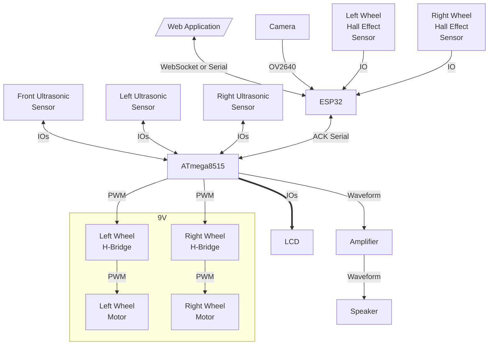
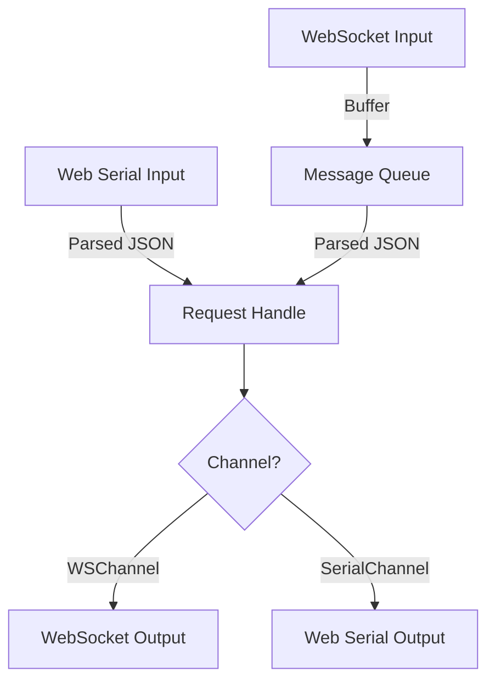
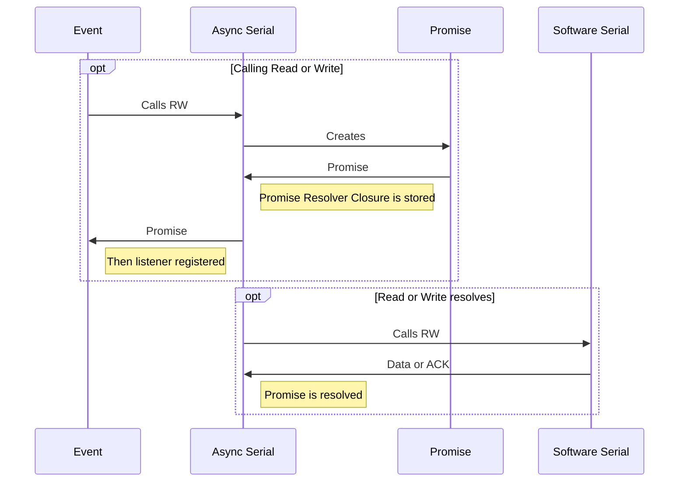
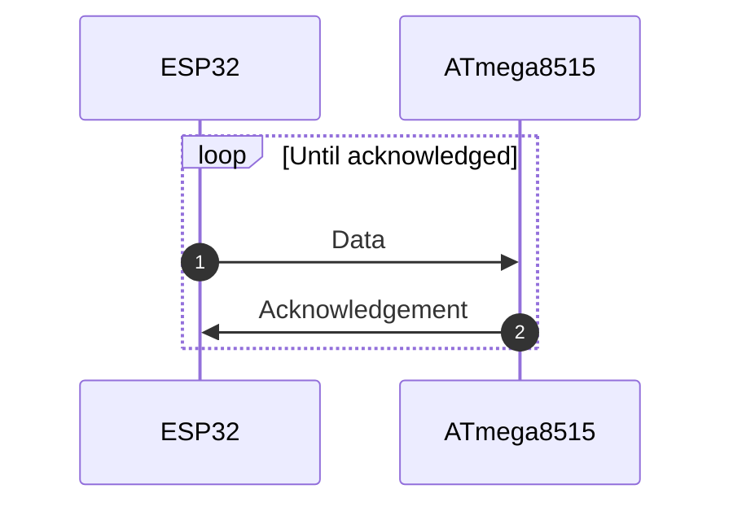

# Wireless Rover

## 1. Overview

Please see one of the following repositories for the latest codebase:

- [Main Account Repository](https://github.com/weisrc/project-wrover)
- [School Account Repository](https://github.com/schoolwei/project-wrover)

This project is setup in a monorepo:

- `./esp` contains the code for the ESP32
- `./avr` contains the code for the ATmega8515
- `./web` contains the code for the web application
- `./pcb` contains the files for creating the PCB

> Disclaimer: This is a school project. Nevertheless, I am open to any feedback and am treating it as one of my personal projects.

## 2. System Diagram

Only the Web Application is not part of the Rover itself. All of the components are powered by a 5V power supply, except for the motors which are powered by a 9V power supply.

*Figure 1. System Diagram*

## A. Web Application

### A.3. Objective

Built using Next.js with TypeScript and Shadcn UI Component Library (stored in `web/components/ui`, not in `node_modules`), the web application is the user interface for the rover. It allows the user to:

- Control the rover
  - Calculate the relative position of the rover from the starting point using the wheel hall effect sensors
  - WASD controls
- View the camera feed
  - Change the camera resolution
  - Change the camera FPS
- Visualize the distances from the ultrasonic sensors
  - Draw the sample points
- Initial WiFi Setup
  - Send the WiFi credentials to the ESP32 via Serial
- Communciate with the rover via WebSocket and Serial

This will be hosted on a seperate server (Raspberry Pi) as the ESP32 will not be connected to the network at first.

### A.4. Schematic Diagram

### A.5. Description

#### A.5.1. Initial WiFi Setup

To connect the ESP32 to the network, the user will need to connect the ESP32 with a client PC that has access to the hosted website using the Serial/USB cable, usually provided with the purchase of a development ESP32 board.

Right now, only Microsoft Edge, Google Chrome and Opera support the Web Serial API, which is required to connect to the ESP32 using the Serial/USB cable. Please refer to [Can I Use](https://caniuse.com/web-serial) for more information.

#### A.5.2. Calculating the Relative Position

Please see `web/lib/dual-odometer.ts` for the implementation of the Dual Odometer.

The calculation is also done on the Web Appllication as it allows the user to easily calibrate and fine-tune the odometer's paramters as all the data is stored in memory. Therefore, by adjusting the parameters, the user will see the sample points change on the canvas. The ESP32 will also calculate the current relative position, but it doesn't store the hall data history.

## B. ESP32

### B.3. Objective

This module is implemented in C++ using the Arduino framework and the PlatformIO toolchain.

The ESP32 is the bridge between the Web Application and the ATmega8515. It's functionalities are:

- Stream the camera feed
- Calculate the relative position of the rover from the starting point using the wheel hall effect sensors
- Broadcasting the locomotion data: hall effect sensors and ultrasonic sensors
- Communicate with the ATmega8515 via Acknowledged Serial
- Communicate with the Web Application via WebSocket
- Smooth motor control

### B.4. Schematic Diagram

### B.5. Description

#### B.5.1. Request and Response Flow

#### B.5.2. Acknowledged Serial

This is implemented using [ESP Software Serial](https://github.com/plerup/espsoftwareserial) . Class `AsyncSerial` is an async (non-blocking, can't handle concurrency) utility for `SoftwareSerial`. This implementation relies on the `Promise` class which is inspired by JavaScript's [Promises](https://developer.mozilla.org/en-US/docs/Web/JavaScript/Reference/Global_Objects/Promise).

Async is required as waiting for the acknowledgement from the ATmega8515 is blocking otherwise, therefore, the Camera will not be able to stream smoothly. This will not be needed if a state machine is implemented. However, Promises in C++ is more interesting to implement. More or less, the state is captured in the Then closure. The Promise class itself doesn't memory manage itself. Therefore, it is wrapped in a `std::shared_ptr`.

Result class is inspired from [Rust's Result](https://doc.rust-lang.org/std/result/). It is used to handle errors in the Promise instead of having to use exceptions.

There is parity checking only. If there is an error, ignore the frame.

#### B.5.3. AVR Serial, Async Serial and Promises in ESP32

#### B.5.4. Transmitting and Receiving Data

#### B.5.5. Smooth Motor Control

To prevent drawing too much current from the ESP32, the rate at which the duty cycle is changed is limited. This is also done on the AVR side for extra safety.

The smooth motor value is sent to the ATmega8515 via the Acknowledged Serial. This value is also used to know the direction of the motor.

- If `l` is sent, the left motor hall effect sensor triggered and the motor is moving forward
- If `r`, then right with forward
- If `L`, then left with reverse
- If `R`, then right with reverse

The above values are stored in a string and sent to the Web Application via WebSocket in the `locomotion.hall` string. For more information, please see the ESP32 and Web Communication section.

#### B.5.6. Hall Effect Sensors

The hall effect sensor readings are implemented using logical change interrupts. Debouncing is implemented to reduce the number of false positives. A series of alternating magnets are placed on the wheel to trigger the hall effect sensor.

#### B.5.7. ESP32 and Web Communication

Communication is either done via WebSocket or Serial. This is done using the `Channel` virtual base class extended by `WSChannel` or `SerialChannel`.

Upon receiving a message form the WebApplication via WebSocket. The buffer is added to the singleton `MessageQueue` instance. The `MessageQueue` instance is then processed in the main loop. This is to prevent blocking the WebSocket thread at unexpected times. E.g. when the camera is streaming or when the `SoftwareSerial` is writing (messes up the timing).

Please see `RequestEvents` and `ResponseEvents` Type Records in `web/lib/types.ts` for more information.

- Requests
  - Connect is used to connect to a network. This is only used in Serial communication mode during the initial setup.
  - Scan is used to scan for available networks.
  - Disconnect is used to disconnect from the network.
  - SSID is used to get the SSID of the connected network.
  - IP: is used to get the IP address of the ESP32.
  - RSSI: is used to get the signal strength of the connected network.
  - Status: is used to get the WiFi status of the ESP32.
  - Begin: is used to start the WebSocket Server.
  - Set Camera FPS: is used to set the camera FPS.
  - Motor is used to control the motors.
  - Locomotion is used to get the locomotion data.
  - Capture is used to capture a frame from the camera.
- Responses
  - Scan returns the available networks.
  - IP returns the IP address of the ESP32.
  - RSSI returns the signal strength of the connected network.
  - Status returns the WiFi status of the ESP32.
  - Locomotion returns the locomotion data.
  - Socket Ready is used to indicate that the WebSocket connection is ready.
  - Binary Data (not JSON) is used to send the camera capture frames.

Status messages are also sent unsolicitedly to the Web Application when the WiFi status changes.

## C. AVR (ATmega8515)

### C.3. Objective

This module is implemented in assembly using AVRA and AVRDude on Linux or Atmel Studio on Windows.

The ATmega8515 is the locomotion controller of the rover. It's functionalities are:

- Generate the PWM to control the motors
- Read the ultrasonic sensors
- Communicate with the ESP32 via Acknowledged Serial
- Display the data on the LCD
- Smooth motor control
- Generate the waveforms for the speaker
- Stop the motors when obstacles are detected

### C.4. Schematic Diagram

### C.5. Description

#### C.5.1. Ultrasonic Sensors

PD4 is set high for 10us to trigger the ultrasonic sensor. PD4 is then set low. The time it takes for the echo to return is measured. The distance is then calculated using the formula:

$\frac{1}{34300cm}=29.154\frac{us}{cm}$

$D_{cm}=\frac{T_{us}}{2 \times 29.154}$

$D_{cm}=\frac{T_{us}}{58.308}$

*Table 1. The calculated distance and the actual distance.*

| Actual Distance (cm) | Time (us) | Calculated Distance (cm) | % Error |
| -------------------- | --------- | ------------------------ | ------- |
| 33.02                | 2003      | 34.53                    | 4.59    |
| 63.5                 | 3711      | 63.98                    | 0.76    |
| 124.46               | 7135      | 123.02                   | 1.16    |

> The above table shows that the ultrasonic sensors are accurate enough for the rover's purposes.

There are 3 ultrasonar sensors being used simultaneously. All of the sensors are triggered at the same time. The echos are read using INT0, INT1 and INT2. The 16-bit Timer 1 is used to measure the timestamps of the echo goes high and when the echo goes low. The difference is then calculated to get the time it takes for the echo to return. The sensors are triggered every time the Timer 1 overflows.

#### C.5.2. PWM and Smooth Motor Control

Timer 1 is also used to generate the PWM for the motors. OC1A and OC1B are used to control the left and right motors respectively. The duty cycle is controlled by the `OCR1A` and `OCR1B` registers. The duty cycle is then changed by the ESP32 via the Acknowledged Serial.

The actual duty cycle is slowly changed to the desired duty cycle to prevent drawing too much current from the power supply.

The ESP32 will send a signed 8-bit integer to the AVR. If the value is negative, the motor will move in reverse. If the value is positive, the motor will move forward. The absolute value of the integer is the duty cycle.

#### C.5.3. Acknowledged Serial

This is implemented using the USART. The ATmega8515 will send an acknowledgement to the ESP32 when it receives a message with the correct parity.

To prevent blocking the main loop when sending a message, both read and write are implemented with circular buffers of 128 bytes. This is done because before writing to UDR, the buffer must be empty. Therefore, this operation may be blocking.

Both Head and Tail pointers are 8-bit and their operation differs depending on the operation. So there are 4 pointers in total:
- Head Pointers: The pointers that writes to the buffer.
  - RX: When the ATmega8515 receives a byte from the USART.
  - TX: When the code wants to send a byte to the USART.
- Tail Pointers: The pointers that reads from the buffer.
  - RX: When the code wants to read a byte from the buffer.
  - TX: When the ATmega8515 sends a byte to the USART.

Since the pointers are 8-bit and the buffers are 128 bytes, the most significant bit is discarded using the `andi` instruction.

`serial_update` will always attempt to send a byte if the circular buffer is not empty. The tail pointer is only incremented after an ACK is received. Please see `avr/ack_serial.inc` for more information.

#### C.5.4. AVR and ESP32 Communication

To prevent blocking the main loop on the AVR, the request handler on the AVR is implemented as a state machine. This is built ontop of the Acknowledged Serial. Please see `avr/handle.inc` for more information. There are two types of states:

- Read States:
  - Motor0: ESP32 is setting the left motor duty cycle and direction
  - Motor1: Set right motor
  - Write: Write characters to the LCD
  - Command: Execute a command on the LCD
- Single-Shot States:
  - None: No request is being handled
  - Sonar0: ESP32 is requesting the distance from the front ultrasonic sensor (2 bytes will be sent subsequently)
  - Sonar1: Read left ultrasonic sensor (2 bytes will be sent subsequently)
  - Sonar2: Read right ultrasonic sensor (2 bytes will be sent subsequently)
  - Clear: Clear the LCD character buffer

Single-Shot states will be executed within the same subroutine call and will immediately return to the None state. Read states will be executed over multiple subroutine (one addtional) calls to gather the data (one byte) to set the motors or write to the LCD.

## License

MIT. Wei. Please see the LICENSE file for more information.

