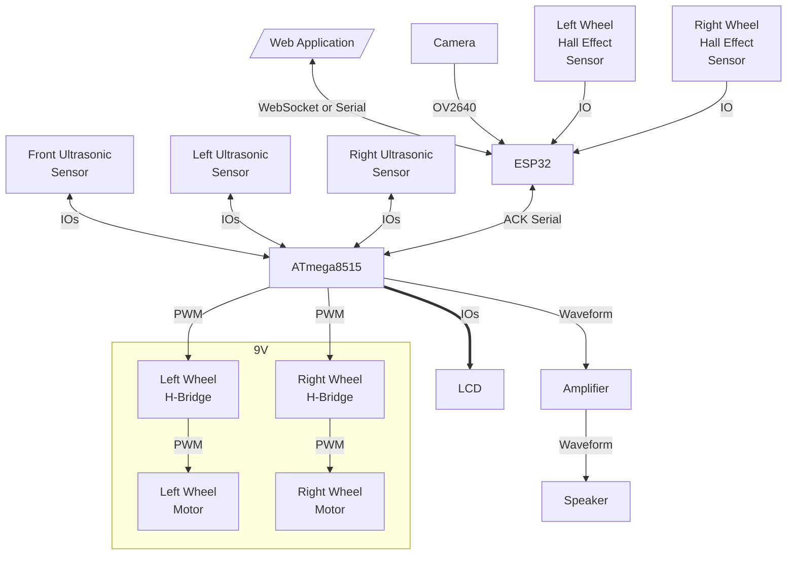

# Wireless Rover

This project is setup in a monorepo:
- `./esp` contains the code for the ESP32
- `./avr` contains the code for the ATmega8515
- `./web` contains the code for the web application
- `./pcb` cotnains the files for creating the PCB

## System Overview Diagram

Only the Web Application is not part of the Rover itself. All of the components are powered by a 5V power supply, except for the motors which are powered by a 9V power supply.

## Web Application

Built using Next.js with TypeScript and Shadcn UI Component Library (stored in `web/components/ui`, not in `node_modules`), the web application is the user interface for the rover. It allows the user to:

- Control the rover
    - Calculate the relative position of the rover from the starting point using the wheel hall effect sensors
    - WASD controls
- View the camera feed
    - Change the camera resolution
    - Change the camera FPS
- Visualize the distances from the ultrasonic sensors
    - Draw the sample points
- Initial WiFi Setup
    - Send the WiFi credentials to the ESP32 via Serial
- Communciate with the rover via WebSocket and Serial

This will be hosted on a seperate server (Raspberry Pi) as the ESP32 will not be connected to the network at first.

### Initial WiFi Setup

To connect the ESP32 to the network, the user will need to connect the ESP32 with a client PC that has access to the hosted website using the Serial/USB cable, usually provided with the purchase of a development ESP32 board.

Right now, only Microsoft Edge, Google Chrome and Opera support the Web Serial API, which is required to connect to the ESP32 using the Serial/USB cable. Please see the following for more information: https://caniuse.com/web-serial

### Calculating the Relative Position

Please see `web/lib/dual-odometer.ts` for the implementation of the Dual Odometer.

The calculation is also done on the Web Appllication as it allows the user to easily calibrate and fine-tune the odometer's paramters as all the data is stored in memory. Therefore, by adjusting the parameters, the user will see the sample points change on the canvas. The ESP32 will also calculate the current relative position, but it doesn't store the hall data history.

## ESP32

The ESP32 is the bridge between the Web Application and the ATmega8515. It will be connected to the network and will communicate with the Web Application via WebSocket. It will also communicate with the ATmega8515 via Serial.

It is also responsible for streaming the camera feed and calculating the relative position of the rover from the starting point using the wheel hall effect sensors.

This module is implemented in C++ using the Arduino framework and the PlatformIO toolchain.

