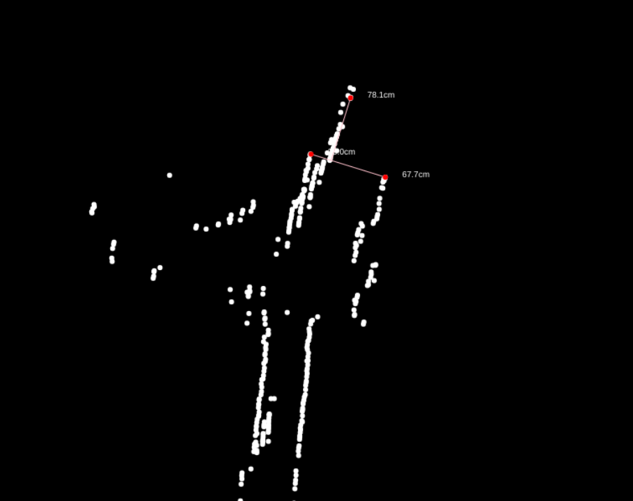
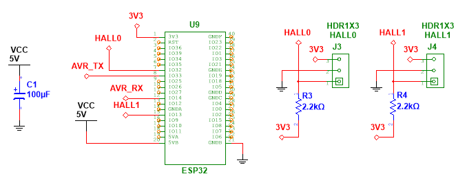
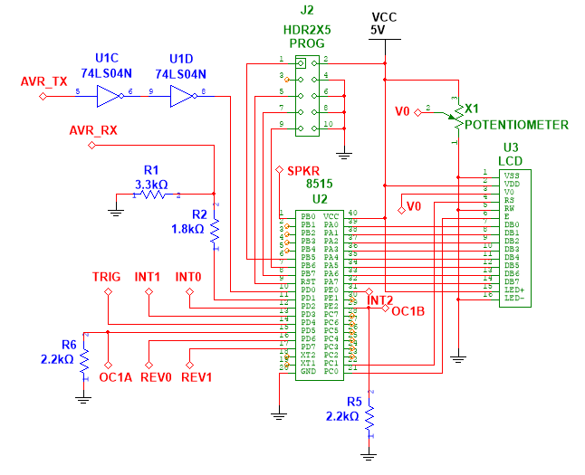

# Wireless Rover

## 1. Overview

Please see one of the following repositories for the latest codebase:

- [Main Account Repository](https://github.com/weisrc/project-wrover)
- [School Account Repository](https://github.com/schoolwei/project-wrover)

This project is setup in a monorepo:

- `./esp` contains the code for the ESP32
- `./avr` contains the code for the ATmega8515
- `./web` contains the code for the web application
- `./pcb` contains the files for creating the PCB
- `./images` contains the images used in this README

> Disclaimer: This is a school project. Nevertheless, I am open to any feedback (PR or issues) and am treating it as one of my personal projects. Furthermore, the format of this README is unconventional as it is intended for a school report. Please use the main account repository for PRs and issues.

### 1.1. About Comments

Only AVR is commented as it is written in assembly and is somewhat difficult to understand. The code for the ESP32 and the Web Application is written in C++ and TypeScript respectively. Therefore, the code is self-explanatory and is commented only when necessary. Furthermore, all functions, variables and subroutines are named descriptively.

## 2. System Diagram

Only the Web Application is not part of the Rover itself. All of the components are powered by a 5V power supply, except for the motors which are powered by a 9V power supply.


_Figure 2.1. System Diagram. The Web Application is not part of the rover. The rest is powered by a 5V battery unless indicated otherwise._

## A. Web Application

### A.3. Objective

Built using Next.js with TypeScript and Shadcn UI Component Library (stored in `web/components/ui`, not in `node_modules`), the web application is the user interface for the rover. It allows the user to:

- Control the rover
  - Calculate the relative position of the rover from the starting point using the wheel hall effect sensors
  - WASD controls
- View the camera feed
  - Change the camera resolution
  - Change the camera FPS
- Visualize the distances from the ultrasonic sensors
  - Draw the sample points
- Initial WiFi Setup
  - Send the WiFi credentials to the ESP32 via Serial
- Communciate with the rover via WebSocket and Serial

This will be hosted on a seperate server (Raspberry Pi) as the ESP32 will not be connected to the network at first.

### A.4. Diagrams


_Figure A.4.1. Web Application Code Block Diagram._

### A.5. Description

#### A.5.1. Initial WiFi Setup

To connect the ESP32 to the network, the user will need to connect the ESP32 with a client PC that has access to the hosted website using the Serial/USB cable, usually provided with the purchase of a development ESP32 board.

Right now, only Microsoft Edge, Google Chrome and Opera support the Web Serial API, which is required to connect to the ESP32 using the Serial/USB cable. Please refer to [Can I Use](https://caniuse.com/web-serial) for more information.

#### A.5.2. Calculating the Relative Position

Please see `web/lib/dual-odometer.ts` for the implementation of the Dual Odometer.

The calculation is also done on the Web Appllication as it allows the user to easily calibrate and fine-tune the odometer's paramters as all the data is stored in memory. Therefore, by adjusting the parameters, the user will see the sample points change on the canvas. The ESP32 will also calculate the current relative position, but it doesn't store the hall data history.

### A.6. Configuration

Please install Node.js with the right version found in package.json. Then run `npm ci` to install the required dependencies.

To run the development server, run `npm run dev`. To build the production version, run `npm run build`.

### A.7. Test Code

The test code is the entire application itself. The application is tested by running it and interacting with it manually.

### A.8. Test Results



_Figure A.8.1. Web Application Sonar Map. This is data sampled by the AVR, requested by the ESP32 and sent to the Web Application along with the Hall Effect sensor information. This is a straight hallway with stairs on the left._


_Figure A.8.2. Web Application Camera View. This is sent in JPEG format frame by frame (Motion JPEG)_

### A.9. Test Code Description

This is in other words a manual integration test.

### A.10. Troubleshooting

There are no major troubleshooting instances. The only issue was with the ESP32 Unresponsive WebSocket. Please see the ESP32 section for more information.

## B. ESP32

### B.3. Objective

This module is implemented in C++ using the Arduino framework and the PlatformIO toolchain.

The ESP32 is the bridge between the Web Application and the ATmega8515. It's functionalities are:

- Stream the camera feed
- Calculate the relative position of the rover from the starting point using the wheel hall effect sensors
- Broadcasting the locomotion data: hall effect sensors and ultrasonic sensors
- Communicate with the ATmega8515 via Acknowledged Serial
- Communicate with the Web Application via WebSocket
- Smooth motor control

### B.4. Diagrams



_Figure B.4.1. ESP Module Schematic Diagram._


_Figure B.4.1. ESP32 Code Block Diagram. All parallelograms are information sources.
When the WiFi status changes, it will send an unsolicitated response._

### B.5. Description

#### B.5.1. Request and Response Flow


_Figure B.5.1.1. Request and Response Flow._

#### B.5.2. Acknowledged Serial

This is implemented using [ESP Software Serial](https://github.com/plerup/espsoftwareserial) . Class `AsyncSerial` is an async (non-blocking, can't handle concurrency) utility for `SoftwareSerial`. This implementation relies on the `Promise` class which is inspired by JavaScript's [Promises](https://developer.mozilla.org/en-US/docs/Web/JavaScript/Reference/Global_Objects/Promise).

Async is required as waiting for the acknowledgement from the ATmega8515 is blocking otherwise, therefore, the Camera will not be able to stream smoothly. This will not be needed if a state machine is implemented. However, Promises in C++ is more interesting to implement. More or less, the state is captured in the Then closure. The Promise class itself doesn't memory manage itself. Therefore, it is wrapped in a `std::shared_ptr`.

Result class is inspired from [Rust's Result](https://doc.rust-lang.org/std/result/). It is used to handle errors in the Promise instead of having to use exceptions.

There is parity checking only. If there is an error, ignore the frame.

#### B.5.3. AVR Serial, Async Serial and Promises in ESP32


_Figure B.5.3.1. Sequence Diagram of AVR Serial, Async Serial and Promises in ESP32._

#### B.5.4. Transmitting and Receiving Data


_Figure B.5.4.1. Sequence Diagram of Transmitting and Receiving Data._

#### B.5.5. Smooth Motor Control

To prevent drawing too much current from the ESP32, the rate at which the duty cycle is changed is limited. This is also done on the AVR side for extra safety.

The smooth motor value is sent to the ATmega8515 via the Acknowledged Serial. This value is also used to know the direction of the motor.

- If `l` is sent, the left motor hall effect sensor triggered and the motor is moving forward
- If `r`, then right with forward
- If `L`, then left with reverse
- If `R`, then right with reverse

The above values are stored in a string and sent to the Web Application via WebSocket in the `locomotion.hall` string. For more information, please see the ESP32 and Web Communication section.

#### B.5.6. Hall Effect Sensors

The hall effect sensor readings are implemented using logical change interrupts. Debouncing is implemented to reduce the number of false positives. A series of alternating magnets are placed on the wheel to trigger the hall effect sensor.

#### B.5.7. ESP32 and Web Communication

Communication is either done via WebSocket or Serial. This is done using the `Channel` virtual base class extended by `WSChannel` or `SerialChannel`.

Upon receiving a message form the WebApplication via WebSocket. The buffer is added to the singleton `MessageQueue` instance. The `MessageQueue` instance is then processed in the main loop. This is to prevent blocking the WebSocket thread at unexpected times. E.g. when the camera is streaming or when the `SoftwareSerial` is writing (messes up the timing).

Please see `RequestEvents` and `ResponseEvents` Type Records in `web/lib/types.ts` for more information.

- Requests
  - Connect is used to connect to a network. This is only used in Serial communication mode during the initial setup.
  - Scan is used to scan for available networks.
  - Disconnect is used to disconnect from the network.
  - SSID is used to get the SSID of the connected network.
  - IP: is used to get the IP address of the ESP32.
  - RSSI: is used to get the signal strength of the connected network.
  - Status: is used to get the WiFi status of the ESP32.
  - Begin: is used to start the WebSocket Server.
  - Set Camera FPS: is used to set the camera FPS.
  - Motor is used to control the motors.
  - Locomotion is used to get the locomotion data.
  - Capture is used to capture a frame from the camera.
- Responses
  - Scan returns the available networks.
  - IP returns the IP address of the ESP32.
  - RSSI returns the signal strength of the connected network.
  - Status returns the WiFi status of the ESP32.
  - Locomotion returns the locomotion data.
  - Socket Ready is used to indicate that the WebSocket connection is ready.
  - Binary Data (not JSON) is used to send the camera capture frames.

Status messages are also sent unsolicitedly to the Web Application when the WiFi status changes.

### B.6. Configuration

To setup the development environment, please use VSCode with the PlatformIO extension. Pulling this repository and opening the `esp` folder will automatically setup the environment. This is tested to work on Linux and Windows.

Please update the value in `esp/src/logger.h` to change the log level.

### B.7. Test Code

Please see the `esp/test` directory for the test code.

Unit testing is done on Vec2 class and the Promise class. Integration testing is done on the AsyncSerial for getting the ultrasonic distance readings.

### B.8. Test Results

All tests passed.

_Code Block B.8.1. Test Results._
```
test/unity_config.cpp:13: test_promise_finallyShouldBeCalled    [PASSED]
test/unity_config.cpp:14: test_promise_thenShouldChain  [PASSED]
test/unity_config.cpp:15: test_promise_pairShouldCombine        [PASSED]
test/unity_config.cpp:16: test_promise_raceShouldCombine        [PASSED]
test/unity_config.cpp:18: test_vec2_shouldAdd   [PASSED]
test/unity_config.cpp:19: test_vec2_shouldTranslate     [PASSED]
test/unity_config.cpp:20: test_vec2_shouldScale [PASSED]
test/unity_config.cpp:21: test_vec2_shouldNormalize     [PASSED]
test/unity_config.cpp:22: test_vec2_shouldLength2       [PASSED]
test/unity_config.cpp:23: test_vec2_shouldLength        [PASSED]
test/unity_config.cpp:24: test_vec2_shouldClone [PASSED]
test/unity_config.cpp:25: test_vec2_shouldSubtract      [PASSED]
test/unity_config.cpp:26: test_vec2_shouldMultiply      [PASSED]
test/unity_config.cpp:27: test_vec2_shouldPolar [PASSED]
test/unity_config.cpp:28: test_vec2_shouldRotate        [PASSED]
test/unity_config.cpp:29: test_vec2_shouldSetDirection  [PASSED]
test/unity_config.cpp:30: test_vec2_shouldZero  [PASSED]
test/unity_config.cpp:32: test_avr_serial_shouldGetSonarReadings        [PASSED]
```

### B.9. Test Code Description

Vec2 class is tested using the Unity testing framework, not the Game Engine. The tests on Vec2 ensure that its methods are working as expected and free of issues. The same can be said for the Promise class.

As for the AsyncSerial, the test is done to ensure that the AVR is responding correcting upon receiving a request for the ultrasonic sensor readings. Then the ESP will need to properly read the value and resolve the promise.

### B.10. Troubleshooting

#### B.10.1. Memory Leak

After implemented the Async Serial with Promises. I found that the ESP would crash after a few minutes. I subsequently logged the heap memory usage of the ESP to see if there was a memory leak and fortunately, it was the case. I know that the internal implementation of the C++ `std::shared_ptr` used reference couting.

Originally, the Promise listeners will not get destroyed after the it is resolved as I thought it wasn't necessary to destroy them as a resolved promise cannot be resolved again. However, `Promise::both` will add listeners to two promises that references the other promise. Therefore, this creates a circular reference and the two promises will never be destroyed as they are referencing each other despite being resolved. Hence, the destruction of the listeners when the promise is resolved fixed the issue.

#### B.10.2. ESP-AVR Serial Corruption

The data sent between the ESP32 and the ATmega8515 will sometimes be corrupted and lead to sending characters to the LCD or changing the motor speed. To address this, I added a parity. However, it wasn't enough. Therefore, I changed the circuit.

Since the ESP32 is 3.3V and the ATmega8515 is 5V, I used a voltage divider to convert the 5V to 3.3V for the ESP32 RX. For the ESP32 TX, I connected it directly to the ATmega8515 RX hoping it will be interpreted as a high signal. However, this was not always the case. Therefore, I conneected it instead to a TTL buffer (two inverters) to convert the 3.3V to 5V. This alleviated the issue.

Since the communication with the AVR is done via SoftwareSerial and therefore interrupts. I know that other interrupts can skew the timing of the SoftwareSerial. I am not certain about the implementation of the AsyncWebServer, but I suspect that it may be using interrupts for WiFi. Therefore, I moved the JSON parsing to the main loop by creating the Message Queue. Further research into the underlying implementation is needed to confirm this.

All of this is done in hope of reducing the number of corrupted frames. I also changed the mode keys to be more unique and hence more entropy to reduce the chance of mode misinterpretation.

#### B.10.3. ESP WebSocket Unresponsive

Early on, the camera frames were sent based on an interval. Eventually, the WebSocket would become unresponsive. This is because the ESP32 was attempting to send faster than it can transmit, filling its internal buffer. Therefore, I changed the implementation to send the next frame only after the previous frame has been sent. This is done by client asking for the next frame after receiving the previous frame. As a result, the framerate is now dependent on the network speed.

## C. AVR (ATmega8515)

### C.3. Objective

This module is implemented in assembly using AVRA and AVRDude on Linux or Atmel Studio on Windows.

The ATmega8515 is the locomotion controller of the rover. It's functionalities are:

- Generate the PWM to control the motors
- Read the ultrasonic sensors
- Communicate with the ESP32 via Acknowledged Serial
- Display the data on the LCD
- Smooth motor control
- Generate the waveforms for the speaker
- Stop the motors when obstacles are detected

### C.4. Diagrams



_Figure C.4.1. AVR Schematic Diagram._


_Figure C.4.2. Motor Logic Schematic Diagram._


_Figure C.4.3. Ultrasonic Sensor Schematic Diagram._


_Figure C.4.4. Speaker Amplifier Schematic Diagram._


_Figure C.4.1. AVR Code Block Diagram. If a dashed connection is used, then the flow of information ends at the head of the arrow. Furthermore, an arrow label starting with `if` must be satisfied to 'flow' and do not convey any information._

### C.5. Description

#### C.5.1. Ultrasonic Sensors

PD4 is set high for 10us to trigger the ultrasonic sensor. PD4 is then set low. The time it takes for the echo to return is measured. The distance is then calculated using the formula:

$\frac{1}{34300cm}=29.154\frac{us}{cm}$

$D_{cm}=\frac{T_{us}}{2 \times 29.154}$

$D_{cm}=\frac{T_{us}}{58.308}$

_Table C.5.1.1. The calculated distance and the actual distance._

| Actual Distance (cm) | Time (us) | Calculated Distance (cm) | % Error |
| -------------------- | --------- | ------------------------ | ------- |
| 33.02                | 2003      | 34.53                    | 4.59    |
| 63.5                 | 3711      | 63.98                    | 0.76    |
| 124.46               | 7135      | 123.02                   | 1.16    |

> The above table shows that the ultrasonic sensors are accurate enough for the rover's purposes.

There are 3 ultrasonar sensors being used simultaneously. All of the sensors are triggered at the same time. The echos are read using INT0, INT1 and INT2. The 16-bit Timer 1 is used to measure the timestamps of the echo goes high and when the echo goes low. The difference is then calculated to get the time it takes for the echo to return. The sensors are triggered every time the Timer 1 overflows.

#### C.5.2. PWM and Smooth Motor Control

Timer 1 is also used to generate the PWM for the motors. OC1A and OC1B are used to control the left and right motors respectively. The duty cycle is controlled by the `OCR1A` and `OCR1B` registers. The duty cycle is then changed by the ESP32 via the Acknowledged Serial.

The actual duty cycle is slowly changed to the desired duty cycle to prevent drawing too much current from the power supply.

The ESP32 will send a signed 8-bit integer to the AVR. If the value is negative, the motor will move in reverse. If the value is positive, the motor will move forward. The absolute value of the integer is the duty cycle.

#### C.5.3. Acknowledged Serial

This is implemented using the USART. The ATmega8515 will send an acknowledgement to the ESP32 when it receives a message with the correct parity.

To prevent blocking the main loop when sending a message, both read and write are implemented with circular buffers of 128 bytes. This is done because before writing to UDR, the buffer must be empty. Therefore, this operation may be blocking.

Both Head and Tail pointers are 8-bit and their operation differs depending on the operation. So there are 4 pointers in total:

- Head Pointers: The pointers that writes to the buffer.
  - RX: When the ATmega8515 receives a byte from the USART.
  - TX: When the code wants to send a byte to the USART.
- Tail Pointers: The pointers that reads from the buffer.
  - RX: When the code wants to read a byte from the buffer.
  - TX: When the ATmega8515 sends a byte to the USART.

Since the pointers are 8-bit and the buffers are 128 bytes, the most significant bit is discarded using the `andi` instruction.

`serial_update` will always attempt to send a byte if the circular buffer is not empty. The tail pointer is only incremented after an ACK is received. Please see `avr/ack_serial.inc` for more information.

#### C.5.4. AVR and ESP32 Communication

To prevent blocking the main loop on the AVR, the request handler on the AVR is implemented as a state machine. This is built ontop of the Acknowledged Serial. Please see `avr/handle.inc` for more information. There are two types of states:

- Read States:
  - Motor0: ESP32 is setting the left motor duty cycle and direction
  - Motor1: Set right motor
  - Write: Write characters to the LCD
  - Command: Execute a command on the LCD
- Single-Shot States:
  - None: No request is being handled
  - Sonar0: ESP32 is requesting the distance from the front ultrasonic sensor (2 bytes will be sent subsequently)
  - Sonar1: Read left ultrasonic sensor (2 bytes will be sent subsequently)
  - Sonar2: Read right ultrasonic sensor (2 bytes will be sent subsequently)
  - Clear: Clear the LCD character buffer

Single-Shot states will be executed within the same subroutine call and will immediately return to the None state. Read states will be executed over multiple subroutine (one addtional) calls to gather the data (one byte) to set a motor speed or write to the LCD.

#### C.6. Configuration

To setup the development environment, please use Atmel Studio on Windows or AVRA and AVRDude on Linux. Please use the Makefile in the `avr` folder to compile and run the code on Linux.

### C.7. Test Code

The AVR's serial is tested using the ESP32's integration test for getting the ultrasonic sensor readings.

### C.8. Test Results

The AVR passed the integration test as the ESP32 was able to get the ultrasonic sensor readings.

### C.9. Test Code Description

Please see the ESP32 section for the test code description.

### C.10. Troubleshooting

The related troubleshooting is written in the ESP32 section.

## 11. Libraries and Tools

### Web Application

Please see `web/package.json` for the list of dependencies.

- [Next.js](https://nextjs.org) for static site generation
- [Shadcn UI](https://ui.shadcn.com) for the UI components

### ESP32

Please see `esp/platformio.ini` for the list of dependencies.

- [ESP Software Serial](https://github.com/plerup/espsoftwareserial) for more serial ports
- [ArduinoJson](https://arduinojson.org) for marshalling and unmarshalling JSON
- [ESP Async Web Server](https://github.com/me-no-dev/ESPAsyncWebServer) for the WebSocket server

### AVR

- [AVRA](https://github.com/Ro5bert/avra) for assembly
- [AVRDude](https://www.nongnu.org/avrdude/) for flashing the hex file

### README.md

- [VSCode Markdown PDF](https://github.com/yzane/vscode-markdown-pdf) for generating the PDF
- [Mermaid](https://mermaid.js.org) for the code-defined diagrams

<details>
<summary>MathJax Scripts for PDF generation</summary>
<script type="text/javascript" src="http://cdn.mathjax.org/mathjax/latest/MathJax.js?config=TeX-AMS-MML_HTMLorMML"></script>
<script type="text/x-mathjax-config">MathJax.Hub.Config({ tex2jax: {inlineMath: [['$', '$']]}, messageStyle: "none" });</script>
</details>

---

## License

MIT. Wei. Please see the LICENSE file for more information.
