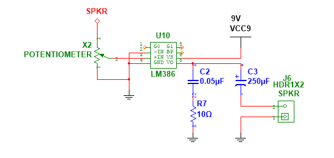

# Progress Report 3

## 1. Changelog

- New 3D visualization web sub-module instead of 2D point cloud.
- PCB design on Ultiboard
- PCB board soldering
- New speaker AVR sub-module
- Camera resolution can now be changed on the fly
- Rover will not move forward if an obstacle is detected in front

## 2. System Diagram

Only the Web Application is not part of the Rover itself. All of the components are powered by a 5V power supply, except for the motors which are powered by a 9V power supply.


_Figure 2.1. System Diagram. The Web Application is not part of the rover. The rest is powered by a 5V battery unless indicated otherwise._

## 3. Sub-Module Objectives

> Note: The core of the three modules are completed. However, there are a few changes made to the sub-modules that this report will cover.

### 3.1. Web Application 3D Visualization

The objective of this sub-module is to provide the user controlling the Wrover more information over the area they are operating in by attempting the reconstruct the walls from the coarser data provided by the ultrasonic sensors.

### 3.2. AVR Speaker and Tune Player

The objective of this sub-module is to provide the user and people around the rover with audio feedback and joy.

- When the rover starts moving, the speaker will play a few iconic notes from [Il fait beau dans l’métro](https://www.youtube.com/watch?v=W7WxVoByjEA).
- On startup, the rover will play the [Microsoft Windows XP Startup Sound](https://www.youtube.com/watch?v=7nQ2oiVqKHw).
- When the rover is near an obtacle, the speaker will keep playing a tune. Right now, it is the same as the moving tune.

## 4. Sub-Module Diagrams

### 4.1. Web Application Wall Reconstruction


_Figure 4.1. Wall Reconstruction Pipeline._

### 4.2. AVR Speaker and Tune Player


_Figure 4.2. Tune Player Reading Notes_


_Figure 4.3. Speaker Schematic Diagram. The X2 value is 10K ohms._

## 5. Sub-Module Description

### 5.1. Web Application 3D Visualization

This sub-module is 100% software and is based on the previous 2D version. It uses the same Request/Response emitters and the same hardware on the Rover.

### 5.2. AVR Speaker and Tune Player

OC0 (PB0) is used to output the waveform to the LM386 amplifier. It is connected to a 9V battery to produce louder sound. There is a filter formed by C2 and R7 to filter out high frequency noise.

TCCR0 is set to Clear Timer on Compare with OCR0 as the max value. There is a prescaler of 8 to bring the frequency down to our hearing range.

## 6. Configuration

### 6.1. Web Application 3D Visualization

Please run `npm ci` again to install the new dependencies.

### 6.2. AVR Speaker and Tune Player

To generate the notes in a different frequency space, please run the `avr/notes_gen.py` file.

## 7. Test Code

### 7.1. Web Application 3D Visualization

_Code 7.1. Mock `useLocomotionData` function._

```ts
export function useTestLocomotionData() {
  const { distanceFront, distanceLeft, distanceRight, data, add } =
    useLocomotionStates();

  useEffect(() => {
    // run once ideally when use hook is called
    const interval = setInterval(() => {
      const item = testData.shift(); // get the first item
      if (item) {
        add(item as LocomotionData);
      }
    }, 100); // every 100ms

    return () => {
      clearInterval(interval); // clear the interval on cleanup
    };
  }, []);

  return { distanceFront, distanceLeft, distanceRight, data };
}
```

### 7.2. AVR Speaker and Tune Player

```asm
.nolist
.include "m8515def.inc"
.list

.cseg

reset: rjmp main
.org $20

main:
    ldi R16, low(RAMEND) ; initiate the stack
	out SPL, R16
	ldi R16, high(RAMEND)
    out SPH, R16

	rcall speaker_init
	rcall player_init
	rcall tunes_init

	ldi r16, TUNES_XP_STARTUP_HEAD ; load the startup sound
	rcall player_set ; set the tune
loop:
	rcall player_update ; advance through the notes
	rjmp loop

.include "utils.inc"
.include "speaker.inc"
.include "dev_utils.inc"
.include "notes.inc"
.include "player.inc"
.include "tunes.inc"
.exit
```

## 8. Test Results

### 8.1. Web Application 3D Visualization


_Figure 8.1. Wall Reconstruction. Hallway with stairs on the left._

### 8.2. AVR Speaker and Tune Player

It sounds like the Windows XP Startup Sound.

## 9. Test Code Description

### 9.1. Web Application 3D Visualization

The following test code is a mock function of `useLocomotionData` that will pretend that the rover is rolling and sending this data.

For more infomration please see the full file at `web/components/canvas/use-locomotion-data.ts`.

`testData` is imported from `web/components/canvas/test-locomotion-data.json`. It is a recording of the data sent by the rover when it was actually moving.

This greatly accelerates the development process as actually moving the rover is time-consuming and consumes battery.

This is encapsulated in a test page at `web/app/replay-test/page.tsx`.

### 9.2. AVR Speaker and Tune Player

There is no dedicated test code for this sub-module. It has been tested directly in `avr/main.asm` at the start with the Windows XP Startup Sound with other unecessary module intiializers and updaters commented out.

## 10. Troubleshooting

### 10.1. Web Application 3D Visualization

The ThreeJS coordinate system is left-handed. This caused some issues with the wall reconstruction as I thought it was a right-handed coordinate system like other libraries and game engines. I finally relalized that the X axis was mirrored when testing it without the replay locomotion data. To address this issue, I scaled the root object by -1 on the X axis.

### 10.2. Testing on PCB board

The hall sensor were not working. The hall sensor output needs to be pulled up to 3.3V. However, I had it pulled down to ground by mistake. This was fixed by scraping off the trace connecting them to ground and solder bridging them to 3.3V. One of the sensors were too far from 3.3V, therefore, I scraped off a trace.

Furthermore, the two left-most pins of the LCD are flipped on the schematic. This was fixed by flipping them when the LCD is connected to the board via jumper wires. If this was not done, it would short 5V to ground directly. Fortunately, the LCD was not damaged.

Another issue was that the ground of the AND gate and the NOT gate were not connected to the system ground. This lead to the wheels and the serial connection to not be working sometimes. This is fixed on the PCB by using a jumper wire. Again, this issue is not present in the current schematic and the PCB board files.

> Note: Both the Schematic and the PCB board files are free of these issues. Therefore, they are slightly different from  the physical PCB presented in this project.

## 11. References

### Web Application

Please see `web/package.json` for the list of dependencies.

- [Next.js](https://nextjs.org) for static site generation
- [Shadcn UI](https://ui.shadcn.com) for the UI components

### ESP32

Please see `esp/platformio.ini` for the list of dependencies.

- [ESP Software Serial](https://github.com/plerup/espsoftwareserial) for more serial ports
- [ArduinoJson](https://arduinojson.org) for marshalling and unmarshalling JSON
- [ESP Async Web Server](https://github.com/me-no-dev/ESPAsyncWebServer) for the WebSocket server

### AVR

- [AVRA](https://github.com/Ro5bert/avra) for assembly
- [AVRDude](https://www.nongnu.org/avrdude/) for flashing the hex file

### Datasheets

- [ATmega8515](https://ww1.microchip.com/downloads/en/DeviceDoc/doc2512.pdf)
- [LM386](https://www.ti.com/lit/ds/symlink/lm386.pdf)
- [DRV5023](https://www.ti.com/lit/ds/symlink/drv5023.pdf)
- [HC-SR04](https://cdn.sparkfun.com/datasheets/Sensors/Proximity/HCSR04.pdf)
- [L298N H-Bridge](https://www.handsontec.com/dataspecs/L298N%20Motor%20Driver.pdf)

### README.md

- [VSCode Markdown PDF](https://github.com/yzane/vscode-markdown-pdf) for generating the PDF
- [Mermaid](https://mermaid.js.org) for the code-defined diagrams
